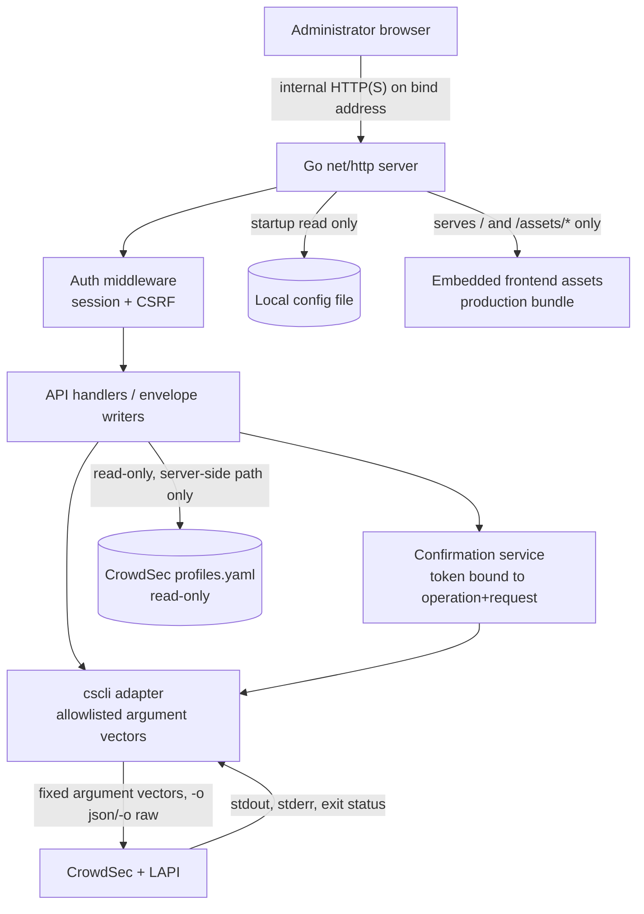

# CrowdSec Dashboard — Architecture, API Contract, and Configuration Schema

Status: **Contract baseline** for the MVP (task 03). Owner: Architecture agent.
Reviewers: Development Lead and Security reviewer (task 13 gate).
Predecessors: `docs/requirements.md` (task 01) and `docs/command-matrix.md` (task 02 — the sole operation allowlist).
Consumers: backend (tasks 04, 05), security (task 06), frontend (tasks 07–10), deployment (task 11), documentation (task 12), review (task 13).

This document is **normative for interfaces only**. It specifies stable boundaries so backend, frontend, security, and deployment agents work in parallel without inventing interfaces. It implements **no server, adapter, authentication, UI, systemd, or installation code**; those are owned by tasks 04–11. Any change to a route, envelope, status code, parameter, or configuration field requires an approved update to this document and the command matrix together.

---

## 1. Scope and non-overridable constraints

The architecture follows the requirements and the matrix without exception:

- **No application database** and **no direct CrowdSec database access**. The only persistence is the local configuration file (single administrator account and server settings). The dashboard never stores copies of alert or decision data (REQ-011, REQ-012).
- **`cscli`-only source of truth** through a strict allowlist adapter (REQ-010, REQ-013). The adapter builds fixed argument vectors internally and never invokes a shell.
- **No arbitrary command execution.** A browser request selects a typed operation identifier and typed parameters only. It can never provide a command name, executable path, shell fragment, raw argument array, flag, pipeline, file path, profile expression, CSV path, token, or CrowdSec configuration text (REQ-014; matrix §5 “No command passthrough”).
- **One-to-one endpoint mapping.** Every functional API endpoint corresponds to exactly one MVP-supported or capability-gated matrix row, or to an explicitly defined fixed application route (health, session, capabilities, confirmation). Rows the matrix marks explicitly unsupported **never** become functional endpoints (see §5.3).
- **The profiles exception** is a separate server-side read-only profiles-file boundary (`profiles.inspect`), not a `cscli` command and not an editing facility. The profiles path is server-side configuration only and never appears in any request.
- **Exclusions hold**: no component install/remove, profile editing, arbitrary configuration editing, notification, or Console-management endpoints (task 03 contracts; matrix §5 “Excluded mutations”).

---

## 2. System architecture and request flow



Primary flow for a data request: browser → authenticated HTTP request → session/CSRF middleware → handler → (mutation: confirmation service verifies the token) → adapter → `cscli` → CrowdSec/LAPI → typed result or safe error → envelope → browser. The local configuration file is read once at startup; it is not a database and is never consulted per request. The production frontend bundle is embedded with the binary and served by the same server (see §9).

Key non-functional properties:

- **Single host, single administrator.** One local account; one expiring session at a time is the expected model (task 06 owns the exact mechanism).
- **No database, no streaming.** Data freshness comes from explicit refresh or bounded polling of the API, never from a local store or a push channel.
- **Capability probing is server-side.** At startup the adapter probes version-dependent support (structured output, filters/`-l`, `machines.prune`, `bouncers.delete`, metrics, CAPI). Results are cached and exposed read-only through `GET /api/v1/capabilities` (§5.2). Unsupported capability is reported as `unsupported`, never guessed into existence.
- **Every mutation is confirmed and refreshes the source of truth.** Confirmation is server-verifiable and bound to the operation plus the typed request (§4.7). After success, the adapter performs the matrix-defined refresh invocation (§5.1 “refresh” column) and the frontend re-fetches affected lists.

---

## 3. Typed boundaries

Package boundaries (Go module under `backend/`, per task 01 §7). These are contracts, not code; tasks 04–06 implement them.

| Package | Responsibility | Must never |
|---|---|---|
| `backend/cmd/crowdsec-dashboard` | Entry point: load config, wire components, start server | contain business logic or command vectors |
| `backend/internal/config` | Parse/validate the configuration file; expose typed settings; `Redacted()` form for logging | touch HTTP, sessions, or requests |
| `backend/internal/auth` | Password verification, session issue/validate/invalidate, CSRF token binding | know operation identifiers or command vectors |
| `backend/internal/adapter` | Operation dispatch, argument-vector construction, process execution, parsing, typed errors, capability probe | touch HTTP, sessions, or configuration beyond the injected executable path/timeout |
| `backend/internal/api` | Routing, middleware hooks, request decoding with unknown-field rejection, envelope writers, confirmation verification | construct commands, resolve executable paths, or read secrets from requests |

Cross-boundary invariants:

1. **The adapter owns every argument vector.** `api` and `auth` never import `os/exec`; the adapter never imports `net/http`. The executable path and per-command timeout come only from `config`.
2. **Handlers exchange typed values only.** The `api` layer knows operation identifiers (`alerts.list`, `decisions.add`, …) and their typed request/result structs; it never sees or forwards raw strings that could become arguments.
3. **Confirmation is verified in `api` against a token issued by the confirmation service**, which binds the token to the operation identifier and the canonical (validated) request. The token is opaque to the frontend; there is no client-computable confirmation.
4. **Sessions are opaque to handlers.** `api` calls the auth middleware hook; it receives an authenticated identity or a 401, never credential material.
5. **Secrets never cross a boundary.** Config redacts secrets for logging; auth never logs hashes or tokens; adapter error mapping produces stable codes and safe messages (matrix §2); `api` never echoes raw stderr or command lines.
6. **Request decoding rejects unknown fields and unsupported query parameters** (Go `json.Decoder.DisallowUnknownFields` for bodies; an explicit allowlist for query parameters) before any adapter call.

Contract signatures (informative, for the Go agents):

```
// adapter
type Executor interface {
    Run(ctx context.Context, op OperationID, req TypedRequest) (TypedResult, *OpError)
    Capabilities(ctx context.Context) map[OperationID]Support  // supported | capability_gated | unsupported
}
type OpError struct { Class ErrorClass; Message string; Retryable bool }

// auth
type Authenticator interface {
    Authenticate(ctx context.Context, password string) (Session, error)
    Validate(ctx context.Context, token string) (Session, error)
    Invalidate(ctx context.Context, token string) error
}

// api
func NewRouter(cfg *config.Config, ex adapter.Executor, au auth.Authenticator, confirm *ConfirmationService) http.Handler
```

---

## 4. API conventions

### 4.1 Base path, content type, transport

- Base path: `/api/v1`. All API responses are `application/json; charset=utf-8`.
- Requests with a body must send `Content-Type: application/json` and a body of at most **16 KiB**.
- Request bodies are decoded with unknown-field rejection; unknown JSON fields → `400 invalid_parameters`. Unknown query parameters → `400 invalid_parameters`.
- Protected data responses are served with `Cache-Control: no-store`.
- All routes are reachable only over the configured bind address; HTTPS is the operator's responsibility when crossing an untrusted network (REQ-061).

### 4.2 Authentication and authorization model

- **Public routes** (no session required): `GET /api/v1/health`, `POST /api/v1/session` (login).
- **All other routes require a valid session**, including all matrix reads, all mutations, session status/logout, capabilities, and confirmation issuance.
- Sessions are server-issued opaque tokens carried in an `HttpOnly`, `SameSite=Strict`, `Path=/` cookie named `crowdsec_dashboard_session`; the `Secure` attribute is set when the request arrived over HTTPS. Session expiry follows §8 (`session.ttl`). Logout invalidates the session server-side (task 06).
- **CSRF:** cookie-authenticated state-changing requests (all `POST`/`DELETE`, including confirmation issuance) must additionally carry the session-bound CSRF token in the `X-CSRF-Token` header. The CSRF token is returned at login and on session status (task 06 implements issuance; this contract fixes the transport requirement).
- Login accepts a single field, `{"password": "..."}` — the administrator identity is implicit (one account). Login failures return `401 invalid_credentials` with an identical message regardless of cause (no account enumeration). Brute-force throttling is a task-06 decision, not part of this API surface.
- Missing, expired, invalid, or logged-out sessions → `401` with error envelope (code `unauthenticated`). CSRF failure → `403` (code `csrf_failed`).

### 4.3 Matrix envelope (success and operation-level failure)

Every matrix-operation response uses the fixed envelope from the matrix (§2). Success:

```json
{
  "operation": "alerts.list",
  "request": { "limit": 50 },
  "result": { "items": [], "page": { "mode": "limit", "limit": 50, "offset": 0, "has_more": false } },
  "source": { "system": "crowdsec", "command": "cscli alerts list", "version": "1.7.8" }
}
```

Operation-level failure (the request was valid and reached the adapter; the operation result is a safe typed error) — returned with **HTTP 200**, exactly as in the matrix:

```json
{
  "operation": "alerts.list",
  "error": { "code": "unsupported", "message": "This CrowdSec installation does not support the requested operation.", "retryable": false }
}
```

Rules:

- `operation` is the fixed matrix identifier bound to the route (§5.1). On mutation requests the body must also carry `operation`, and it must equal the route's bound operation; otherwise `400 invalid_parameters`.
- `request` echoes the **validated, normalized** request (defaults applied, filters normalized) on success. It is omitted from the failure envelope, matching the matrix example.
- `result` is the typed result. `error` is present exactly when `result` is absent, and vice versa.
- `source.command` is the **fixed operation label** from the matrix — never the executed argument vector, and never containing paths, credentials, or raw stderr. `source.version` is the matrix target version (`1.7.8`).
- Application routes (health, session, capabilities, confirmation) do not use the matrix envelope; their shapes are defined in §4.6/§5.2.

### 4.4 HTTP status codes

HTTP status expresses the **request-level** outcome. A completed matrix operation — including adapter-level failures carried in the `error` envelope — returns **200**. Non-2xx statuses mean the operation did not run.

| Status | Code in envelope | Meaning |
|---|---|---|
| 200 | — | Success envelope, or operation-level failure envelope (adapter classes in §4.5) |
| 400 | `invalid_parameters` | Malformed JSON, unknown fields, unknown/unsupported query parameters, type/range/enum violations, operation/route mismatch, missing required fields, unsupported `limit`/`offset` for the operation |
| 400 | `confirmation_required` | Mutating request without a `confirmation` field |
| 401 | `unauthenticated` | Missing/expired/invalid/logged-out session on a protected route |
| 401 | `invalid_credentials` | Login failure (identical message for all causes) |
| 403 | `csrf_failed` | State-changing request without a valid `X-CSRF-Token` |
| 404 | `not_found` | Unknown route; unknown path resource (`alerts.inspect` absent alert, `metrics.show` unknown component is `invalid_parameters` instead); deleted/absent typed target |
| 405 | `method_not_allowed` | Route exists with a different method |
| 409 | `invalid_confirmation` | Confirmation token missing/mismatched/expired/not bound to this operation+request |
| 500 | `internal` | Unexpected server error (safe message only) |
| 503 | `unavailable` | Server is stopping or not ready (liveness still reports `ok` only while serving) |

### 4.5 Error classes and safe messages

Adapter-level classes (from the matrix §2), always inside the `error` envelope with HTTP 200 unless noted:

| `error.code` | Meaning | Safe default message | retryable |
|---|---|---|---|
| `invalid_parameters` | `cscli` rejected a parameter value at execution time | “The requested parameters were rejected by CrowdSec.” | false |
| `permission_denied` | Service account lacks permission; never retried with elevation | “The dashboard does not have permission to perform this operation.” | false |
| `timeout` | Command exceeded the configured `cscli.timeout` | “The operation timed out. Try again.” | true |
| `unavailable` | `cscli` executable missing or not resolvable | “CrowdSec command-line tools are unavailable.” | true |
| `unsupported` | Installed command/flag/capability not supported | “This CrowdSec installation does not support the requested operation.” | false |
| `malformed_output` | Expected JSON/raw output was malformed | “CrowdSec returned unexpected output.” | false |
| `crowdsec_failure` | Non-zero exit with no more specific class | “CrowdSec rejected the requested operation.” | false |

Request-level codes (HTTP as in §4.4): `invalid_parameters`, `confirmation_required`, `unauthenticated`, `invalid_credentials`, `csrf_failed`, `not_found`, `method_not_allowed`, `invalid_confirmation`, `internal`, `unavailable`.

Error envelopes never contain secrets, hashes, tokens, raw stderr, or executed command lines (REQ-063).

### 4.6 Application route shapes (non-matrix)

**Health** — `GET /api/v1/health` (public; pure liveness, never probes `cscli`; it is an application route, not a command endpoint):

```json
{ "status": "ok", "service": "crowdsec-dashboard", "version": "0.1.0", "time": "2026-08-05T10:00:00Z" }
```

**Login** — `POST /api/v1/session` (public). Request `{"password": "..."}`. Success (200) sets the session cookie and returns:

```json
{ "session": { "authenticated": true, "expires_at": "2026-08-05T18:00:00Z", "csrf_token": "s_csrf_<opaque>" } }
```

Failure: `401` with `{ "error": { "code": "invalid_credentials", "message": "Invalid username or password.", "retryable": true } }`.

**Session status** — `GET /api/v1/session` (protected). Authenticated → `{ "session": { "authenticated": true, "expires_at": "...", "csrf_token": "s_csrf_<opaque>" } }` (200). Otherwise `401 unauthenticated`. The frontend uses this for expired-session handling.

**Logout** — `DELETE /api/v1/session` (protected). Invalidates the session, clears the cookie, returns `{ "session": { "authenticated": false } }` (200). Logged-out token reuse → `401 unauthenticated`.

**Confirmation issuance** — `POST /api/v1/confirmations` (protected, CSRF-protected). Request `{"operation": "<mutation op>", "request": {<typed request>}}`. The server validates the operation is a mutation and validates the typed request **before** issuing a token. Response (200):

```json
{
  "confirmation": {
    "operation": "decisions.add",
    "token": "c_<opaque, bound to operation+request+session>",
    "expires_at": "2026-08-05T10:05:00Z",
    "action": "Add an active decision for 198.51.100.7",
    "command_label": "cscli decisions add"
  }
}
```

`token` expires after 5 minutes and is bound to the operation identifier, the canonical validated request, and the issuing session. `action` is a fixed human label identifying the CrowdSec action (never a command line).

### 4.7 Mutation confirmation contract

- Every matrix mutation requires a `confirmation` field in the request body — a token previously issued by `POST /api/v1/confirmations` for that exact operation and request.
- The server recomputes the binding: **any difference in the operation or any typed request field invalidates the token** → `409 invalid_confirmation`. Expiry → same.
- Confirmation is therefore **server-verifiable and bound to the operation and typed request**, not a frontend-only flag (task 03 contract; task 06 enforces at the middleware and handler level).
- Destructive or multi-item mutations additionally require confirmation by matrix definition: all included mutations are confirmed (matrix §5). There are no unconfirmed mutations in the MVP.

### 4.8 Pagination and filters

- `page.mode` is `limit` for `alerts.list` and `decisions.list` **only when** startup capability probing confirms the `-l` flag; otherwise it is `none` for those operations and always `none` for every other read.
- `limit`: integer 1–500; default 50 for `alerts.list`, 100 for `decisions.list` (matrix §3). Accepted only when the operation's page mode is `limit`; otherwise the parameter is rejected (`400 invalid_parameters`).
- `offset`: **not part of the MVP request surface.** The matrix applies offset only where a verified offset/page flag exists; none is verified for 1.7.8, so requests containing `offset` are rejected (`400 invalid_parameters`). Responses in `limit` mode carry `page.offset: 0` for envelope stability.
- `page.has_more` is `true` when the adapter received exactly `limit` items, else `false`. Because offset is unsupported, **the frontend cannot fetch a next page**; `has_more` is informational only and must not drive unbounded fetching (task 08).
- Filters are **named, typed query fields only** (§6). No expression language, SQL, regex, or flag strings are accepted. Unsupported filter fields for the installed version → `400 invalid_parameters`.

---

## 5. Route ↔ matrix one-to-one mapping

### 5.1 Matrix operation endpoints

`AUTH` = valid session required. `CONF` = confirmation required. `CG` = capability-gated (probing decides availability; absence reports `unsupported`). Page mode per §4.8.

| Method | Route | Matrix operation | Page | AUTH | CONF | Refresh (source of truth) |
|---|---|---|---|---|---|---|
| GET | `/api/v1/alerts` | `alerts.list` | limit* | yes | — | alerts + overview count |
| GET | `/api/v1/alerts/{id}` | `alerts.inspect` | none | yes | — | none |
| GET | `/api/v1/decisions` | `decisions.list` | limit* | yes | — | decisions + overview count |
| POST | `/api/v1/decisions` | `decisions.add` | none | yes | yes | `decisions.list` |
| DELETE | `/api/v1/decisions` | `decisions.delete` | none | yes | yes | `decisions.list` |
| GET | `/api/v1/machines` | `machines.list` | none | yes | — | machines/status |
| POST | `/api/v1/machines/prune` | `machines.prune` (CG) | none | yes | yes | `machines.list` |
| GET | `/api/v1/bouncers` | `bouncers.list` | none | yes | — | bouncers |
| DELETE | `/api/v1/bouncers` | `bouncers.delete` (CG) | none | yes | yes | `bouncers.list` |
| GET | `/api/v1/hub` | `hub.list` | none | yes | — | component views |
| GET | `/api/v1/scenarios` | `scenarios.list` | none | yes | — | scenarios |
| GET | `/api/v1/scenarios/{scenario}` | `scenarios.inspect` | none | yes | — | none |
| GET | `/api/v1/collections` | `collections.list` | none | yes | — | collections |
| GET | `/api/v1/profiles` | `profiles.inspect` (file boundary) | none | yes | — | file view |
| GET | `/api/v1/simulation` | `simulation.status` | none | yes | — | simulation status |
| GET | `/api/v1/allowlists` | `allowlists.list` | none | yes | — | allowlists |
| POST | `/api/v1/allowlists` | `allowlists.create` | none | yes | yes | `allowlists.list` |
| DELETE | `/api/v1/allowlists` | `allowlists.delete` | none | yes | yes | `allowlists.list` |
| GET | `/api/v1/allowlists/check` | `allowlists.check` | none | yes | — | none |
| POST | `/api/v1/allowlists/entries` | `allowlists.add` | none | yes | yes | `allowlists.list` + `decisions.list` |
| DELETE | `/api/v1/allowlists/entries` | `allowlists.remove` | none | yes | yes | `allowlists.list` |
| GET | `/api/v1/metrics/{component}` | `metrics.show` (CG, optional) | none | yes | — | affected metric card only |
| GET | `/api/v1/status/lapi` | `lapi.status` | none | yes | — | status |
| GET | `/api/v1/status/capi` | `capi.status` (CG, optional) | none | yes | — | status |

\* `limit` mode only when capability probing confirms `-l`; otherwise `none` and `limit` is rejected (§4.8).

### 5.2 Fixed application routes (never command endpoints)

| Method | Route | Purpose | AUTH |
|---|---|---|---|
| GET | `/api/v1/health` | Liveness (no `cscli` probe) | public |
| POST | `/api/v1/session` | Login | public |
| GET | `/api/v1/session` | Session status / expiry + CSRF token | yes |
| DELETE | `/api/v1/session` | Logout (server-side invalidation) | yes |
| GET | `/api/v1/capabilities` | Read-only per-operation support status from the startup probe cache | yes |
| POST | `/api/v1/confirmations` | Issue a confirmation token bound to operation+request | yes |

`GET /api/v1/capabilities` returns `{ "capabilities": { "alerts.list": "supported", "decisions.add": "supported", "machines.prune": "capability_gated", "alerts.delete": "unsupported", ... } }` over every matrix row. Values are `supported | capability_gated | unsupported`. It executes **no** command at request time; the UI uses it to render available/unavailable/unsupported states (tasks 07–10) and must never create a functional control for `unsupported` rows.

### 5.3 Explicitly unsupported matrix rows — no endpoint

These rows are deliberately **not** mapped to any route and must never become functional endpoints (task 03 contract; matrix §4/§5):

`alerts.delete`, `decisions.import`, `machines.delete`, `bouncers.add`, `hub.update`, `scenarios.install`, `collections.install`, `collections.remove`, `simulation.enable`, `simulation.disable`, `allowlists.import`.

A request to any non-existent route (including any of the above) returns `404 not_found`. `GET /api/v1/capabilities` reports each as `unsupported` so the UI can mark them unavailable.

---

## 6. Request schemas and validation

Validation is performed at the API boundary **before** any adapter call (matrix §2/§3). Identifiers, values, and limits below are copied from the matrix; the adapter builds the fixed argument vector from these typed fields only.

Common field rules (matrix §3):

- `limit` — integer 1–500; default 50 (`alerts.list`) / 100 (`decisions.list`).
- `id` — integer > 0.
- `name`, `scenario` — CrowdSec identifier matching `^[A-Za-z0-9][A-Za-z0-9_./:-]{0,255}$`.
- `ip_or_range` — IP or CIDR validated with a standard parser (no free-form strings).
- `duration`, `expiration` — `^[0-9]+(s|m|h|d)$`, bounded ≤ 365 days.
- `reason`, `description`, `comment` — UTF-8, 1–256 chars, newline-free; passed as one argument only.
- `filter.*` — only the named fields below; values are typed (never expressions or flag strings).

### 6.1 Reads

| Operation | Query parameters | Constraints |
|---|---|---|
| `alerts.list` | `limit`, `filter.scenario`, `filter.ip`, `filter.scope`, `filter.kind` | `limit` per §4.8; `filter.scenario` hub id; `filter.ip` IP/CIDR; `filter.scope`/`filter.kind` safe token `^[A-Za-z][A-Za-z0-9_-]{0,63}$`; unsupported filter flag for installed version → `400` |
| `alerts.inspect` | path `{id}` | `id` integer > 0; absent alert → `404 not_found` |
| `decisions.list` | `limit`, `filter.ip`, `filter.scope`, `filter.type`, `filter.origin`, `filter.scenario` | same rules as `alerts.list` |
| `machines.list`, `bouncers.list`, `hub.list`, `scenarios.list`, `collections.list`, `profiles.inspect`, `simulation.status`, `allowlists.list`, `lapi.status`, `capi.status` | none | no query parameters accepted (any → `400`) |
| `scenarios.inspect` | path `{scenario}` | hub identifier; absent → `404 not_found` |
| `allowlists.check` | `ip_or_range` | IP/CIDR, required |
| `metrics.show` | path `{component}` | enum `acquisition \| appsec \| lapi`; anything else → `400 invalid_parameters`; unsupported component for the install → `unsupported` envelope |

### 6.2 Mutations (request bodies)

All mutation bodies: `{ "operation": "<op>", "request": {<typed fields>}, "confirmation": "<token>" }` — `operation` must match the route (§4.3), `confirmation` per §4.7.

| Operation | `request` fields | Required | Validation notes |
|---|---|---|---|
| `decisions.add` | `ip_or_range`, `duration`, `reason` | all | IP/CIDR; duration grammar ≤365d; reason 1–256 chars; `--bypass-allowlist`, bulk, `--origin`, `--scenario` are never exposed |
| `decisions.delete` | `ip_or_range` | yes | IP/CIDR; **no** delete-by-id, `--all`, bulk, `--origin`, `--scenario` |
| `machines.prune` | `duration?`, `not_validated_only?` | none | `not_validated_only` boolean; omitted duration uses CrowdSec's default; when supplied without `not_validated_only`, duration must be ≥ 2m (grammar `s/m/h/d`); with `not_validated_only`, no minimum applies; never `--force` |
| `bouncers.delete` | `name` | yes | identifier rule; never accepts or displays a token; absent name → `404 not_found` |
| `allowlists.create` | `name`, `description` | both | name identifier; description 1–256 chars (required by `cscli` 1.7.8) |
| `allowlists.add` | `name`, `ip_or_range`, `expiration?`, `comment?` | name, ip_or_range | expiration duration grammar; comment 1–256; never CSV paths or import flags |
| `allowlists.remove` | `name`, `ip_or_range` | both | identifier + IP/CIDR; Console-managed entries rejected as read-only |
| `allowlists.delete` | `name` | yes | identifier; Console-managed/unknown names rejected; no bulk delete |

Mutation result envelope (200):

```json
{
  "operation": "decisions.add",
  "request": { "ip_or_range": "198.51.100.7", "duration": "4h", "reason": "Observed brute force" },
  "result": { "status": "success", "action": "Added an active decision for 198.51.100.7", "refreshed": ["decisions.list"] },
  "source": { "system": "crowdsec", "command": "cscli decisions add", "version": "1.7.8" }
}
```

`result.refreshed` lists the matrix-defined refresh operation(s) the adapter executed after the mutation. The frontend re-fetches the same lists before re-rendering affected views.

---

## 7. Example payloads

**Read (paginated, filtered)** — `GET /api/v1/alerts?limit=50&filter.scenario=crowdsecurity/ssh-bf` →

```json
{
  "operation": "alerts.list",
  "request": { "limit": 50, "filter": { "scenario": "crowdsecurity/ssh-bf" } },
  "result": {
    "items": [
      {
        "id": 42,
        "start_at": "2026-08-05T09:58:00Z",
        "scenario": "crowdsecurity/ssh-bf",
        "scope": "Ip",
        "value": "198.51.100.7",
        "decisions": [ { "type": "ban", "duration": "4h" } ]
      }
    ],
    "page": { "mode": "limit", "limit": 50, "offset": 0, "has_more": false }
  },
  "source": { "system": "crowdsec", "command": "cscli alerts list", "version": "1.7.8" }
}
```

Item shapes above are **representative**: the authoritative typed item schema is produced by the adapter from `cscli -o json` output per matrix parsing rules (task 04); `api` passes the typed shape through unchanged. The frontend builds against the typed shape and renders only known fields.

**Empty collection** — `result.items: []`, `page.has_more: false`, HTTP 200 (valid, not an error).

**Operation-level failure** — HTTP 200 with the §4.3 error envelope (`permission_denied`, `timeout`, `unavailable`, `unsupported`, `malformed_output`, `crowdsec_failure`, or execution-time `invalid_parameters`).

**Request-level failure** — e.g. `POST /api/v1/decisions` with a non-IP target →

```json
{ "operation": "decisions.add", "error": { "code": "invalid_parameters", "message": "The request parameters are invalid.", "retryable": false } }
```

with HTTP 400. Unauthenticated → HTTP 401 `{ "error": { "code": "unauthenticated", "message": "Authentication is required.", "retryable": false } }`.

**Mutation flow (two calls)** — confirmation issuance (§4.6), then the mutation (§6.2). Mismatched/expired/missing token → HTTP 409 `{ "error": { "code": "invalid_confirmation", "message": "The confirmation does not match this request.", "retryable": false } }`; missing field → HTTP 400 `confirmation_required`.

---

## 8. Configuration schema

The local configuration file is the **only** persistence (REQ-012). It is read at startup by `config`; an invalid file is a clear startup error and the server exits without listening (task 05). The file is server-side only — no configuration value ever arrives from a browser request.

- Format: YAML (CrowdSec ecosystem convention). Location default `/etc/crowdsec-dashboard/config.yaml`, overridable only by the single `--config <path>` flag.
- File permissions: `0600`, owned by the service account (enforced in deployment, task 11).
- Secret-handling rules: the only secret is `auth.admin_password_hash` (§8.2). Samples use a non-secret placeholder. Logs and errors never include the hash, sessions, tokens, or command vectors (REQ-063).

### 8.1 Field table

| Field | Type | Required | Default | Validation |
|---|---|---|---|---|
| `server.bind` | string | no | `127.0.0.1` | valid IP or hostname; **never** default `0.0.0.0` (REQ-061) |
| `server.port` | int | no | `8090` | 1–65535; must not collide with LAPI default `8080` on the same host |
| `cscli.executable_path` | string | no | `/usr/bin/cscli` | absolute path; if unset, resolved from the controlled service environment (REQ-015); must resolve at startup or the server refuses to start |
| `cscli.timeout` | duration | no | `30s` | `^[0-9]+(s\|m\|h)$`, 1s–120s; per-command execution timeout |
| `cscli.crowdsec_config_dir` | string | no | `/etc/crowdsec` | server-side directory; used **only** by the `profiles.inspect` read-only reader as `<dir>/profiles.yaml`; never browser-controlled, never an editing facility (task 03 contract) |
| `auth.admin_password_hash` | string | yes | — | argon2id/bcrypt hash of the administrator password (algorithm chosen by task 06); **never** plaintext; no default discoverable password (REQ-060) |
| `session.ttl` | duration | no | `8h` | 15m–24h; fixed expiry (no sliding renewal in MVP) |
| `session.cookie_name` | string | no | `crowdsec_dashboard_session` | `^[A-Za-z0-9_-]{1,64}$` |
| `logging.level` | enum | no | `info` | `debug \| info \| warn \| error` |
| `logging.format` | enum | no | `text` | `text \| json` |
| `logging.output` | string | no | `stderr` | `stderr` or an absolute log path owned by the service account |

### 8.2 Sample configuration shape (non-secret placeholder)

```yaml
server:
  bind: "127.0.0.1"            # default; localhost only — never 0.0.0.0 by default
  port: 8090                   # default; avoid LAPI's 8080 on the same host

cscli:
  executable_path: "/usr/bin/cscli"   # default; or resolved from service environment
  timeout: "30s"                       # per-command timeout
  crowdsec_config_dir: "/etc/crowdsec" # optional; read-only profiles reader only

auth:
  # SECRET — set by the documented setup procedure only.
  # Never commit a real hash; samples use the placeholder below.
  admin_password_hash: "<set-by-crowdsec-dashboard-setup-admin>"

session:
  ttl: "8h"
  cookie_name: "crowdsec_dashboard_session"

logging:
  level: "info"
  format: "text"
  output: "stderr"
```

### 8.3 Configuration contracts

- On first start with the placeholder/unset hash, the server **refuses to start** and prints a fixed instruction pointing at the documented administrator-setup procedure (no default password is ever created; task 06/12).
- `cscli.crowdsec_config_dir` exists solely for the approved read-only `profiles.inspect` boundary. It is never an input to any command and never exposed to the browser.
- Bind/port/logging/session values are operator settings; unsafe defaults are prohibited (§8.1).

---

## 9. Frontend asset delivery

- **Development.** The Next.js dev server (default port 3000, task 07) proxies `/api/*` to the Go backend at `http://127.0.0.1:<server.port>`. The backend serves **only** `/api/*` in development; the UI is served by Next.js. The proxy target is developer configuration, not a browser input.
- **Production (native packaging).** `next build` produces the static bundle into `assets/` (task 11). The Go binary embeds the bundle (`go:embed`) and serves it:
  - `/` and `/assets/*` → the embedded frontend bundle (content-hashed files with cache headers).
  - `/api/*` → API routing only; API routes are never shadowed by assets.
  - Any non-API `GET` path → SPA fallback `index.html` (client-side routing), **except** that `/api/*` unknowns return `404` JSON, never `index.html`.
  - **Never served**: configuration files, `profiles.yaml`, the executable path, raw command lines, raw command output, or any file outside the bundle. No directory traversal is possible (only embedded files are addressable).
- The contract is agnostic to embed-vs-sidecar delivery; task 11 fixes the packaging choice. Both must preserve the API-first routing rules above.

---

## 10. Verification checklist (how this document is checked)

1. **One-to-one matrix mapping.** Every functional endpoint in §5.1 maps to exactly one matrix row with matching method, page mode, confirmation, and refresh; every supported/capability-gated row in `docs/command-matrix.md` §4 appears exactly once; every row in §5.3 is marked `unsupported` with no endpoint. (Count check: 24 supported endpoints ↔ 24 supported/capability-gated rows; 11 unsupported rows ↔ 0 endpoints; 24 + 11 = 35 matrix rows.)
2. **No command/executable-path/file-path input.** No route, query parameter, or body field accepts command text, executable paths, raw flags, shell fragments, filesystem paths, CSV paths, profile expressions, or tokens. `cscli.executable_path` and `crowdsec_config_dir` are configuration-only and never appear in requests.
3. **Envelope correctness.** Success responses carry `operation`, `request`, `result`, `source.command` (fixed label); failures carry `operation` + `error {code, message, retryable}`; `source.command` never exposes the executed argument vector.
4. **Confirmation is server-verifiable** and bound to operation + typed request; missing/mismatched/expired tokens are rejected deterministically (400/409).
5. **Config review.** The only secret is the password hash (hash-only, placeholder in samples, no default); bind default is `127.0.0.1`; no secret or command vector reaches logs.
6. **No-database / allowlist consistency.** The architecture (§2) contains no application database and no direct CrowdSec DB access; unsupported component install/remove, profile editing, arbitrary configuration, notification, and Console-management endpoints are absent.

**Reviewer status:** Pending Development Lead and Security reviewer sign-off (task 13). Version-dependent rows remain capability-gated per the matrix.
