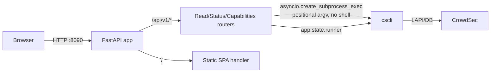

# CrowdSec Dashboard — Architecture

## Goal

The CrowdSec Dashboard ships a **FastAPI backend** and a **Vite-built SPA**
(frontend) served together on a **single port (8090)**. The backend exposes
read-only, JSON API endpoints under `/api/v1/*` and serves the static SPA at
`/`. There is **no application database** and **no shell** execution.

## Pieces (one port)

Two pieces run as one process (uvicorn serving `backend/main.py:app`):

- **FastAPI backend** — read-only API under `/api/v1/*`, enveloped JSON,
  `cscli` subprocess execution.
- **Vite SPA frontend** — static assets in `frontend/dist/`, served by the
  backend's static catch-all handler (task-08).



## cscli execution model

- Commands are run via **asyncio subprocess execution**
  (`asyncio.create_subprocess_exec`).
- Arguments are passed **positionally**; **no shell** is involved.
- The executable path comes from the **config** (`cscli.executable_path`) or,
  when unset/absent, from the bootstrap fallback list:
  [`/usr/bin/cscli`, `/usr/local/bin/cscli`, `/opt/crowdsec/bin/cscli`].
- Every command has a **per-command timeout** (1s..120s, from
  `cscli.timeout`). A timeout yields the operation-level `timeout` error.
- **Capability probes are cached at startup** in `app.state.capabilities`;
  if `cscli` cannot be resolved or fails to run, all ops report
  `unsupported`.

## Config schema

The config is **slim**: only three top-level keys — `server`, `cscli`,
`logging`. The `Config` model uses Pydantic v2 with `extra="ignore"`, so
**legacy `auth` / `session` top-level blocks are silently ignored**. Operators
with an older YAML that still contains them need not panic; they are inert.

```yaml
server:
  bind: 127.0.0.1
  port: 8090
  static_dir: ../frontend/dist
cscli:
  executable_path: /usr/bin/cscli   # optional
  timeout: 30s
logging:
  level: info
  format: text
  output: stderr
```

## Validation rules

The following exact `ValueError` messages come from `backend/config.py`:

- `server.bind` must not be `0.0.0.0` →
  `server.bind 0.0.0.0 is not allowed; bind to loopback or a NIC IP`
- `server.port` must not be `8080` (reserved for CrowdSec LAPI) →
  `server.port 8080 is reserved for CrowdSec LAPI`
- `cscli.timeout` must match `^\d+s$` (e.g. `'30s'`) →
  `cscli.timeout must match ^\d+s$ (e.g. '30s')`
- `cscli.timeout` must be between 1s and 120s →
  `cscli.timeout must be between 1s and 120s`
- `logging.level` must be one of `debug|info|warn|error`
- `logging.format` must be one of `text|json`

## Response envelopes

All API responses except `/api/v1/health` use one of the three operation
envelopes (no `source.command`, no `page` fields):

- **success** — `{"operation": <op>, "result": <data>}` — HTTP 200
- **operation_error** — `{"operation": <op>, "error": {"code": <code>,
  "message": <safe_msg>}}` — HTTP 200
- **request_error** — `{"error": {"code": <code>, "message": <safe_msg>}}`
  — HTTP 4xx/5xx
- **health** — `{"status": "ok"}` — raw, **outside** the operation envelope —
  HTTP 200

Ten error codes exist:

- **Request-level** (HTTP 4xx/5xx): `invalid_parameters`, `not_found`,
  `method_not_allowed`, `internal`.
- **Operation-level** (HTTP 200): `crowdsec_failure`, `timeout`,
  `unavailable`, `permission_denied`, `malformed_output`, `unsupported`.

## Static serving rules

Per plan §6, the static catch-all handler (task-08) enforces:

- **GET/HEAD only**; other methods return the 405 envelope.
- **Exact match** on the on-disk file first.
- **`.html` fallback** (e.g. `/about` → `about.html`).
- **SPA fallback** returns **200 `index.html`** (React Router owns client
  routes) — **not** a 404.
- **`/api/*` never falls through** to static; API paths are not served by the
  static handler.
- **`no-store`** for `index.html` / the SPA fallback.
- **`public, max-age=31536000, immutable`** for `assets/*`.

## Out of scope (dropped — plan §11)

The following are **explicitly dropped** per plan §11 and are NOT part of this
release:

- **auth / session** — login, session management, and admin
  password hashing are deferred.
- **mutations** — no write/state-changing operations.
- **`/metrics/{component}`** endpoint.
- **command-matrix** documentation.
- **pytest / automated test suite** (the build script does not run tests).
- **Go** rewrite of the backend.

If you are looking for any of these, they are intentionally absent from the
current scope.