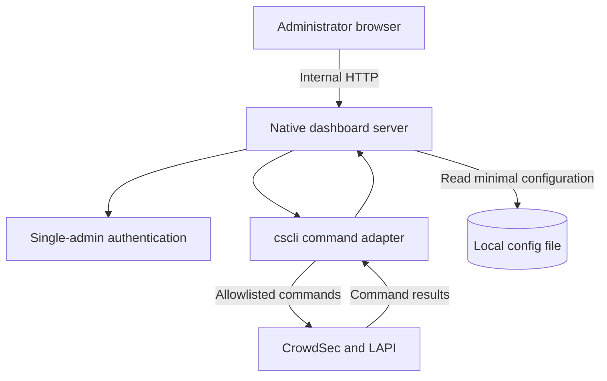

# Executive Summary

The goal of this project is to build an **internal dashboard** for CrowdSec that runs directly on a host where CrowdSec is installed. The first version serves **a single administrator**, stores only minimal configuration in a local file, and uses **`cscli` as its sole integration boundary** for reading status and performing approved CrowdSec operations.

The initial scope prioritizes a simple native installation that is easy to operate on an internal network. The dashboard displays alerts, decisions, machine status, and the CrowdSec components required for daily administration. Every mutating action maps to a specific, controlled `cscli` command.

## 1. Backend Integration with CrowdSec

The dashboard does not access the CrowdSec database directly and does not maintain a separate application database. The backend provides an adapter that invokes `cscli` commands, reads structured output where supported, and converts command failures into clear messages for the interface.

The MVP should support these command groups:

- **Alerts:** equivalent to `cscli alerts list` and `cscli alerts inspect`, with filtering and pagination in the interface.
- **Decisions:** equivalent to `cscli decisions list`, including required management actions such as deleting or adding a decision if those actions are included in the MVP.
- **Machines and status:** use `cscli machines` and suitable status commands to display CrowdSec status.
- **Scenarios, profiles, and collections:** display the current configuration; enable or disable items only when a corresponding `cscli` command exists and the action is explicitly defined in the command matrix.
- **Allowlists and bouncers:** display and manage them through supported `cscli` commands.
- **CrowdSec metrics:** display them only when needed on the dashboard; they are ordinary CrowdSec data, not a Prometheus/Grafana integration or an external monitoring system.

The adapter must use a configured `cscli` path or locate it through the service environment, accept parameters only from an allowlist, and never construct commands directly from raw browser input. The backend must also control the process permissions so the dashboard can perform the required CrowdSec commands without gaining unnecessary access.

## 2. System Architecture

The dashboard and CrowdSec run on the same host. The dashboard does not replace LAPI/CAPI, query CrowdSec's internal database, or require a separate database server.

The primary flow is: the browser calls the dashboard, the dashboard authenticates the administrator, and then it calls the adapter. The adapter executes defined `cscli` commands and returns the data to the interface. The local configuration file contains only the single administrator account and server settings; it does not store copies of alert or decision data.

## 3. Development Plan

| Milestone | Scope / Result |
|---|---|
| **1. Requirements and command matrix** | Finalize the MVP pages, map each feature to a `cscli` command, and define expected output, allowed parameters, and displayed errors. |
| **2. Backend adapter** | Build the native Go backend, minimal HTTP API, and secure `cscli` adapter; serve the frontend's static assets. |
| **3. Frontend/UI** | Build the Next.js/TypeScript dashboard with overview, alerts, decisions, machines, scenarios/profiles, allowlists, and bouncers based on the command matrix. |
| **4. Single-admin access** | Add login for one administrator, application sessions/tokens, local configuration, and operation-level restrictions. |
| **5. Native deployment** | Package the Linux binary with the frontend assets; support direct execution or systemd, with configuration for the `cscli` path, port, and bind address. Do not use Docker or Podman. |
| **6. Documentation and handover** | Write installation, start/stop/update, administrator configuration, filesystem permissions, and troubleshooting instructions for failed `cscli` commands. |

Deliverables include requirements documentation, a command matrix, an architecture diagram, backend and frontend source code, sample configuration, native/systemd installation instructions, administrator-account instructions, and troubleshooting documentation. There are no deliverables for database migrations, backup/restore procedures, testing programs, monitoring platforms, or notification workflows.

## 4. AI and Human Responsibilities

AI can assist with the following work, with a developer reviewing the output before use:

- **Architecture:** propose the single-host diagram and dashboard → adapter → `cscli` flow.
- **Command mapping:** create the list of required CrowdSec commands, expected output, and allowed parameters.
- **Backend:** create the Go HTTP API skeleton and `cscli` adapter, with careful review of exit codes, output, and parameters.
- **Frontend:** create table views, filters, alert/decision details, and operation status displays using Next.js.
- **Documentation:** draft native installation, configuration, and troubleshooting guides.

The development team is ultimately responsible for the correctness of the command matrix, parameter restrictions, process permissions, and behavior when CrowdSec commands fail. The plan does not include agents for Dockerfiles, GitHub Actions, automated testing, monitoring, or notifications.

## 5. Deployment and Operations

The dashboard is installed directly on the CrowdSec host and does not require Docker, Kubernetes, Podman, or an application database.

- **Installation:** install the dashboard binary and frontend assets in a dedicated directory; configure the `cscli` path, CrowdSec configuration file if needed, bind address, and port.
- **Service execution:** run it directly in the internal environment or register it as a systemd service. The guide must cover start, stop, restart, and update procedures.
- **Networking:** bind to localhost or a trusted internal network interface by default. If remote access is required, the administrator should provide HTTPS appropriate for the internal infrastructure.
- **Permissions:** run the dashboard process with the minimum permissions required to invoke the necessary `cscli` commands and read related configuration. The administrator configuration file must have restricted filesystem permissions.
- **Logging:** record startup events, configuration errors, failed commands, and communication errors at a level sufficient for diagnosis. Never log passwords, tokens, or secrets.
- **Data:** the dashboard does not own a database and does not require a separate data backup. CrowdSec remains the source of truth, accessed through `cscli`.

Grafana, Prometheus, monitoring systems, alerting, email/webhook notifications, and CI/CD pipelines are outside the scope of this phase.

## 6. Security

Because this is an internal dashboard, it should use practical security controls appropriate for one administrator instead of a complex identity system.

- **Authentication:** one local administrator account, with the password stored as a secure hash; sessions/tokens must expire and be protected from unauthorized access.
- **Access restrictions:** bind to localhost or a trusted internal network by default. Use HTTPS when the dashboard crosses an untrusted network.
- **Command execution:** allow only command groups and parameters defined in the command matrix; never accept arbitrary shell fragments from the frontend.
- **Process permissions:** use a service account and minimum filesystem permissions; do not run the dashboard as root unless required by the CrowdSec installation method.
- **Secrets and logs:** never display or record passwords, credentials, or CrowdSec tokens; error messages must not expose secrets.
- **Updates:** keep the binary and its libraries on supported versions during manual updates.

LDAP, OIDC, multi-role RBAC, user management, DDoS-oriented rate limiting, Vault, formal penetration testing, and expanded GDPR compliance are not required for the initial internal scope.

## 7. Priority Features and UI/UX Requirements

**Core MVP features:**

- **System overview:** display CrowdSec status, machines, and current alert/decision counts.
- **Alerts/Decisions:** searchable, filterable, paginated tables with detail views equivalent to the relevant `cscli` commands.
- **Dashboard statistics:** display alert/decision history when the data available through `cscli` is sufficient; update through page refresh or simple polling rather than promising real-time streaming.
- **Scenarios/Profiles:** display configuration and support enable/disable operations backed by `cscli`.
- **Allowlists/Bouncers:** display and manage them according to the command matrix.
- **Login:** one login screen for the single administrator.
- **Operation errors:** display failed commands, readable causes, and refresh status so the administrator can respond.

The interface should be clear and prioritize data tables and filters. Every mutating control must identify the corresponding CrowdSec action and require confirmation for operations that may delete or change multiple items.

## 8. Technology Selection

| Component | Choice | Rationale |
|---|---|---|
| **Frontend** | Next.js + TypeScript | Provides fast hot reload and an efficient development workflow while supporting a structured dashboard application and production builds. |
| **Styling** | Tailwind CSS | Enables fast, consistent dashboard styling without requiring a large UI framework. |
| **Charts** | A small charting library for internal dashboard charts | Used only for alert/decision statistics; it does not replace a monitoring platform. |
| **Backend** | Go with `net/http` | Fits the CrowdSec ecosystem and produces a native binary that is easy to install. |
| **CrowdSec integration** | `os/exec` through a strict `cscli` allowlist adapter | Avoids dependence on internal database schemas, uses the official CLI interface, and controls parameters. |
| **Storage** | No application database | The dashboard only needs a local configuration file for one administrator and server settings. |
| **Deployment** | Linux binary, frontend assets, direct execution or systemd | Matches the internal native scope without Docker, Kubernetes, CI/CD, Grafana, or Prometheus. |

PostgreSQL, MySQL/MariaDB, and SQLite are not selected as dashboard databases. Electron, Grafana, Blazor, and heavier backend frameworks are also outside the MVP requirements. Next.js/TypeScript and Go keep a clear boundary between the user interface and `cscli` integration.

## 9. Documentation and Reviewers

| Document / Artifact | Description | Reviewer |
|---|---|---|
| **Requirements document** | MVP features, single-admin scope, native deployment constraints, and access requirements. | Product Owner, Development Lead |
| **Command matrix** | `cscli` commands, output, allowed parameters, mutating effects, and expected errors. | CrowdSec domain reviewer, Backend Developer |
| **Architecture design** | Single-host diagram, internal HTTP API, and `cscli` adapter. | Development Lead |
| **Backend/Frontend source** | Dashboard, local authentication, and CrowdSec screens. | Development peers |
| **Deployment guide** | Binary/assets installation, configuration, filesystem permissions, systemd, and start/stop/update procedures. | System operator |
| **User and troubleshooting guide** | Login, dashboard operations, and `cscli` error handling. | System administrator |

Each artifact should be checked for consistency with the command matrix and single-host scope. A separate QA process, CI/CD, backup/restore, monitoring, or notification process is not required for the first version.

**References:** The integration design is based on official CrowdSec documentation and the behavior of the supported `cscli` commands in the deployment environment.
